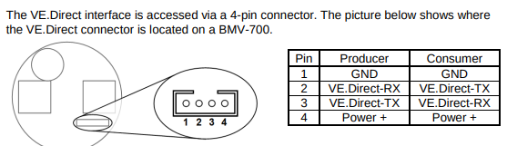

# ardupilot_scripts
ardupilot scripts for sea drone

## Repository Structure

The repository contains a `scripts` directory that is symlinked to the ArduPilot repository. This allows the scripts to be used directly within the ArduPilot environment.

### Setting up the Symlink

To create the symlink between this repository and ArduPilot:

```bash
ln -s ~/repos/ardupilot_scripts/scripts ~/repos/ardupilot/scripts
```

This creates a symbolic link that makes the scripts in this repository available to ArduPilot while maintaining the ability to version control them separately.

### Available Scripts

The `scripts` directory contains:

- `auto_position.lua`: A Lua script for automated vehicle position management and mode control. This script provides intelligent waypoint-based navigation control with automatic mode switching capabilities.

  Features:
  - Monitors vehicle position relative to waypoints
  - Calculates distance to last waypoint
  - Implements automatic mode switching based on position
  - Integrates with ArduPilot's mission system
  - Provides position reporting to GCS
  - Configurable distance threshold for mode switching

  Functionality:
  - Position Monitoring:
    - Tracks current vehicle position
    - Calculates distance to last waypoint
    - Updates position data in real-time
    - Reports position information to GCS

  - Mode Control:
    - Automatically switches to MODE6 when distance threshold is exceeded
    - Integrates with MIS_DONE_BEHAVE parameter
    - Provides fallback to manual control
    - Enables automatic mission continuation

  Parameters:
  - MODE6: Target mode for automatic switching
    - Set to AUTO for automatic mission continuation
    - Set to any other value to disable automatic switching
  - MIS_DONE_BEHAVE: Mission completion behavior
    - Set to Manual for proper script operation
    - Controls vehicle behavior after mission completion

  Usage:
  1. Configure Parameters:
     - Set MODE6 to desired automatic mode (typically AUTO)
     - Set MIS_DONE_BEHAVE to Manual
     - Verify mission waypoints are properly set

  2. Load and Run:
     - Load the script in ArduPilot
     - Script will automatically start monitoring position
     - Position updates will be sent to GCS
     - Mode switching will occur automatically when conditions are met

  3. Operation:
     - Vehicle will complete mission waypoints
     - After last waypoint, will drift in manual mode
     - When 200m from last waypoint, switches to MODE6
     - Continues operation in new mode

  Example Scenario:
  1. Vehicle completes mission waypoints
  2. Switches to manual mode (MIS_DONE_BEHAVE = Manual)
  3. Drifts away from last waypoint
  4. At 200m distance, switches to MODE6 (AUTO)
  5. Continues operation in automatic mode

  Note: This script is particularly useful for missions requiring automatic mode switching after waypoint completion, such as long-duration operations or missions requiring different behaviors at different stages.

- `serial_vedirect.lua` : A Lua script that reads voltage and current data of a Smartsolar charge controller using VE.Direct protocol data from a serial port and sends formatted values to the Ground Control Station (GCS). This script is particularly useful for monitoring solar and battery data from Victron Energy devices.

  Features:
  - Reads VE.Direct protocol data at 19200 baud rate
  - Parses solar power (PPV), solar voltage (VPV), solar current (IPV), battery voltage (BV), and battery current (BI)
  - Sends formatted data to GCS every second
  - Handles checksum validation and hex data
  - Uses Scripting Serial Port 0 for communication

  Usage:
  1. Connect a Victron Energy device to Scripting Serial Port 0
  2. Configure the device for VE.Direct protocol output
  3. Load the script in ArduPilot
  4. The script will automatically start sending formatted data to GCS

  Hardware Requirements:
  - Victron Energy device with VE.Direct output
  - Serial connection to Scripting Serial Port 0
  - Proper voltage level conversion if needed (Victron devices typically use 5V logic)
  - 

  Output Format:
  ```
  PPV: XX.XX W, VPV: XX.XX V, IPV: XX.XX A, BV: XX.XX V, BI: XX.XX A
  ```
  Where:
  - PPV: Solar Power in Watts
  - VPV: Solar Voltage in Volts
  - IPV: Solar Current in Amperes
  - BV: Battery Voltage in Volts
  - BI: Battery Current in Amperes

  Note: The script uses the VE.Direct protocol state machine to ensure accurate data parsing and validation.

## Setting up SITL

Before running the simulation, you need to set up the Software In The Loop (SITL) environment. Please follow the official ArduPilot documentation for setting up SITL on Linux:

[Setting up SITL on Linux](https://ardupilot.org/dev/docs/setting-up-sitl-on-linux.html)

This guide will walk you through:
- Installing required dependencies
- Setting up the build environment
- Configuring SITL for your system

## Running SITL Simulation

The repository includes a `run_sim.sh` script to launch ArduPilot's Software In The Loop (SITL) simulation for a motorboat vehicle.

### Prerequisites
- ArduPilot installed and configured
- Python environment with required dependencies
- SITL simulation files (including eeprom.bin)

### Running the Simulation

1. Make the script executable:
```bash
chmod +x run_sim.sh
```

2. Run the simulation:
```bash
./run_sim.sh
```

The script will:
- Kill any existing sim_vehicle processes
- Launch a new SITL simulation with the following configuration:
  - Vehicle type: Rover
  - Frame: motorboat
  - Location: Orakei Bay
  - Speedup: 1x
  - Serial2 interface: UART on /dev/ttyUSB1
  - Console and map interfaces enabled

3. Arm throtle or disarm

To arm or disarm the vehicle in SITL using MAVProxy, use the following commands in the MAVProxy console:

- To arm:
  ```
  arm throttle
  ```
- To force arm (bypass checks):
  ```
  arm throttle force
  ```
- To disarm:
  ```
  disarm
  ```


For more details and advanced options (such as enabling/disabling specific arming checks), see the official ArduPilot documentation: [Arming and Disarming with MAVProxy](https://ardupilot.org/mavproxy/docs/uav_configuration/arming.html)

### Simulation Files

The SITL simulation uses several files in the simulation directory:
- `eeprom.bin`: Stores simulated vehicle parameters
- `motorboat.parm`: Vehicle-specific parameters
- Other configuration files as needed


### Alternative Configurations
The script includes commented-out alternative configurations for:
- Different serial interfaces
- CSV-based simulation
- Different USB device paths

To use an alternative configuration, uncomment the desired line and comment out the current active configuration.


### Python Scripts in /src
see [src/README.md](src/README.md) for detailed documentation of available python scripts and usage instructions.
